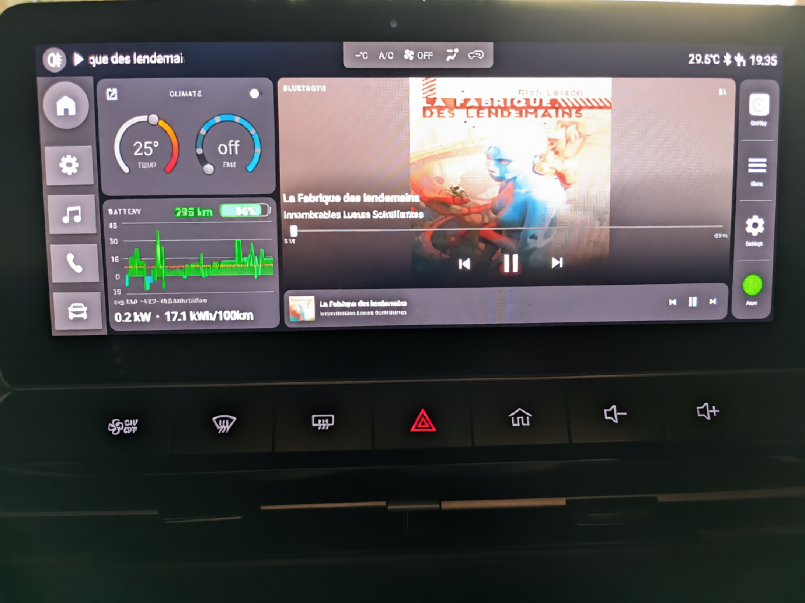
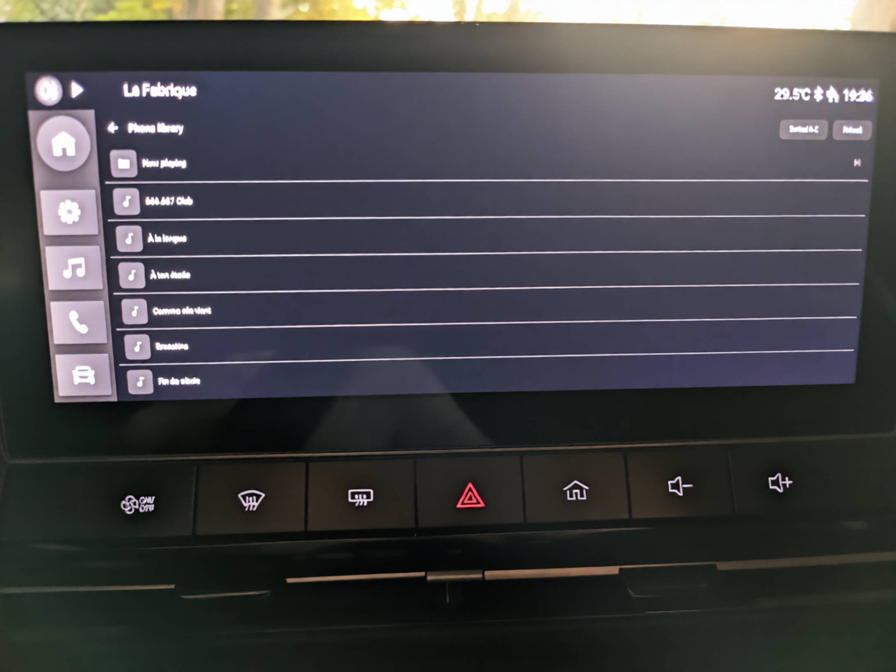
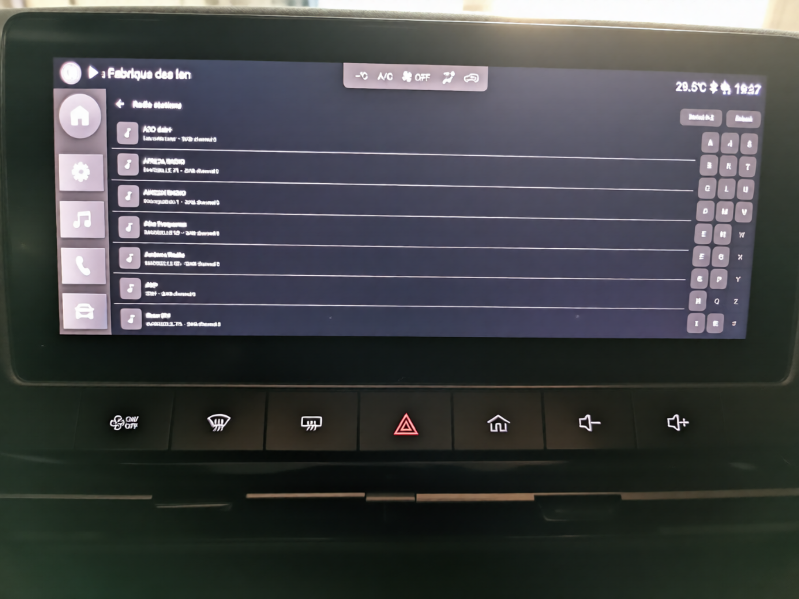
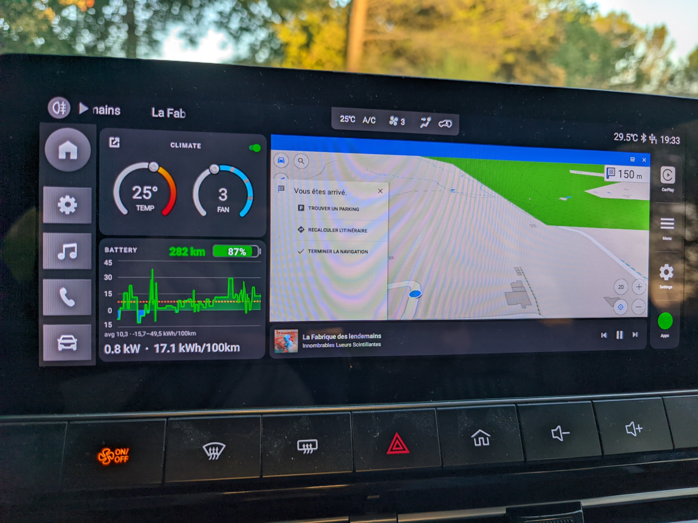

# Custom Launcher for MG4, updated

A clean, modern Android launcher designed for the MG4 vehicle infotainment system.

[](docs/images/MainInterface.png)

This is an updated version from Adam McDonald version that was enhanced and modified to run on MG4 Standard Edition.
It's been developed mainly by retro engineering by Claude AI and manual customization.

## Disclaimer

I take no responsibility for any damage or voided warranty that may occur as the result of using this launcher. Use at your own risk.

The app is not affiliated with SAIC or the MG4 in any way.

## Status

The current code implements a launcher, whose goal is to replace the default MG4 launcher by adding more features in a convenient user interface and experience.
It doesn't modify the car interfaces and doesn't disturb the driving behavior.

Compared to MG4 standard edition launcher, it provides:

### Enhanced media player (bluetooth and radio) player

1. It supports displaying cover art, like this [](docs/images/MainInterface.png)
2. It supports browsing the phone music library directly (no need to use your phone in your hand) with shortcuts, like this [](docs/images/LibraryBrowsing.png)
3. It supports listing the radio stations, scanning like this [](docs/images/RadioStation.png)
4. It has a nice interface (larger to use)

### Enhanced climate controller

1. The climate control is available on the front page directly, no need to go to the HVAC page for basic control.
2. It has a nice interface

### Enhanced energy controller

1. The energy tile displays the journey's consumption, instant power, average consumption, remaining battery and estimated range in a single interface.
2. It gives the remaining charging time
2. It has a nice interface

### GPS location tile

1. Display the current GPS coordinates and allow to launch GPS software as fullscreen or in place of the media player
2. Integrated interface like this: [](docs/images/NavigationInterface.png)
3. Easy return to the media control by switching panels

### Setting menu and shortcuts

1. Various parameters and logs can be directly changed in a dedicated menu
2. Can trigger CarPlay and or Android Auto
3. Can display all apps
4. Provide a setting screen where it's possible to enable/disable WIFI and add/remove Bluetooth connections (which the main launcher fails to do).

## Installation

To install on your MG4 SE, you'll need to copy the following files on a USB key:
1. This repository's APK file
2. The release APK from [Tommaso Vietina's Swipe Launcher](https://github.com/Tommasov/MG4_Swipe_Launcher)
3. F-Droid apk from [here](https://f-droid.org/F-Droid.apk)
4. (Optional but recommanded) [Tommaso Vietina's Simple Launcher](https://github.com/Tommasov/MG4_Simple_Launcher)

Initial installation:

1. Then on your car, plug the USB key in the left USB port (the USB-A port, not the USB-C port)
2. Open the MG4 setting menu (the gear icon on the left bar) then select Bluetooth. Click to change the name, a keyboard appears
3. Press and hold the `,` (comma) key, a popup dialog open, select "Switch language"
4. A dialog open, click "change language"
5. On the top right of the screen, click on the magnifying glass icon
6. Search for "Backup" (localized to your language: for French, search for "Sauvegarde")
7. The car will propose the "Backup" item, click on it, and then on the top left "Back" icon
8. You are now in the Android's setting menu. You can enable developer options if you want (not required unless you intend to develop on the system)
9. In the menu, look for "Storage" item, and click on it.
10. In the storage menu, you'll see the USB drive on the bottom. You can click on it to open a file browser
11. In the file browser, select all the APK you've on your USB key and click to top right "menu" button, then "Copy to"
12. Select "Downloads" folder, then press to bottom right button "Copy"
13. Once the files are in the "Downloads" folder, click on the "MG4CustomLauncher.apk" first. Choose "Yes" then "Install" and hit "Open" (beware not to miss this since it's the only way to trigger it once).
14. Once it opens, you can click on the "Settings" icons on the right to enable "WIFI" and connect to your phone's Access point sharing (this is required for F-Droid to download its application lists).
15. Then press "back" icon and click on the "Apps" button on bottom right to open the "Files" application again and continue installing other applications. Don't press the home button or you'll have to restart from step 2 to reopen this launcher.
16. Then install the MG4_Swipe_Launcher, it will ask for permissions and you'll have to grant them. If you can directly set it, try to select "Custom launcher" application as the launcher, but if you can't, no problem, you'll do it later
17. Install the "MG4_Simple_Launcher.apk" since it's the default launcher MG4_Swipe_Launcher is starting on swipe (and you need a launcher to launch apps)
18. Once it's installed you'll need to reboot the Head Unit twice for the swipe launcher to work (if you don't know how to do that: hold down the "Home" **physical** button on your car for 30s)
17. After the head unit booted, wait for the "Synchronized " toast message to appear (and then ~10s), then try to swipe from the bottom to the center of the screen, on the right half of the screen.
18. Swiping up from the left half of the screen emulate the "back" button, swiping from the right half triggers the launcher. From a service perspective, nothing looks modified on your car.
19. If the MG4_Swipe_Launcher didn't work, restart from step 2 above after the HU reboot and try to reinstall it (and select "Open" after that). Permissions that were already granted are kept, so it shouldn't ask you for more permissions.
20. In the MG4 Simple Launcher it's triggering, you can click in "All apps" button, then "MG4 Simple launcher", grant the required permissions (twice) and select "Custom Launcher" as the default launcher to trigger. You're done.
21. In the application list, I advise you to install F-Droid and let it download its application list. From there, you'll be able to install "OsmAnd~" for the GPS application".
22. In OSMAnd interface, click on the menu, then Maps and download only the map for the area you're in (the available disk space is very low on this system), or choose to use online maps only (but you'll need to connect to your phone's shared WIFI each time you use the GPS software)
23. In the Custom launcher, you can select the GPS application to trigger by click on the GPS tile anywhere, except the "monitor" icon. Once it's selected, you can change it in the menu if you want.
24. Don't use ABRP for the GPS application, since it's using Google's service which aren't installed on this system. It appears to work, but driving directions don't work correctly.

## Troubleshooting

### Album arts don't show
Make sure your phone Bluetooth is set to use AVRCP 1.6.
If you don't know how, you'll need to enable developer settings first on your phone (7 taps on the build version in your settings menu / About this phone), and in the developer settings (a new entry in the "System" menu of the settings), you'll find Bluetooth AVRCP version.
Once it's changed, disable bluetooth on your phone, and enable it again. Then open the MG's bluetooth link on your phone, and click on the Gear icon, choose "Car" for the bluetooth type.
Note that you'll need to reenable AVRCP 1.6 after each boot of your phone, I don't know why.

### Bluetooth player doesn't list its tracks

For the track listing to work, you need a Bluetooth player that supports the feature. I'm using [Booming Music](https://github.com/mardous/BoomingMusic). Make sure to use latest version (1.4.0) for the working feature set.
You can also use [Auxio](https://github.com/OxygenCobalt/Auxio) that works well but has a more dated interface.

### How do I get EV charging station lists?

You can install "EV Map" (search in F-Droid). It gives you the nearest charger on a map and can trigger driving via OSMAnd's GPS. Make sure to enable your phone's WIFI shared AP while using the app.

### Any useful application?

[MG4Control](https://github.com/SliDeeN/MG4Control) lets your set your driving profile (like One pedal, temperature, LKA, ...) and auto apply on boot (or enable it on the "Star" key on your driving wheel, or enable when your phone Bluetooth connection is detected)
If you need to fiddle with your car, you can install Termux (find version 0.101, that the only version that does install on the system).
Also SAI from F-Droid is an installer that allow you to install XAPK packages.
In the Custom launcher setting menu, you can also enable ADB if you need to.

### Network access
Currently, the car has a 4G modem so it's actually connected to the internet. But it's not expected to be used for downloading a lot of data (and MG can lock you or detect your usage if you do).
So make sure you're enabling Access Point sharing on your phone for any access that need (a lot of) data from the Internet.


## Original notice from Adam McDonald:

## Notes

This app was 99% written by Claude AI, as I have no experience with Android development. I have only tested it on a Trophy MG4 running R67 of the FICM. You will need to grant the app permissions to access the device storage and Bluetooth for the media controls and album art to work.

I am sure there are better ways to do this, but this seems to do the job so far.

I would like to be able to replace the system sidebar at some point, but that will require more research and testing.

## Features

- **Battery & Range Display**: Shows real-time battery level and estimated range from SAIC vehicle service
- **Time & Date Widget**: Clean display of current time and date with auto-updates
- **Now Playing Card**: Displays current media playback information with album art and controls
- **Bluetooth Album Art**: Automatically loads album artwork from Bluetooth connected devices
- **App Shortcuts**: Quick access to installed applications
- **Debug Dialog**: Triple-tap the clock to view live logs (useful for on-car troubleshooting)
- **Clean Dark UI**: Modern Material Design with dark theme optimized for automotive use

## Key Components

### 1. Battery/Range Display

- Connects to SAIC SDK via reflection to get real-time battery data
- Uses `VehicleChargingManager.getCurrentElectricQuantity()` for battery percentage
- Uses `VehicleChargingManager.getCurrentEnduranceMileage()` for range in kilometers
- Color-coded battery card (green/yellow/red based on level)
- Click to open SAIC Charge Management Activity

### 2. Media Integration

- Uses Android MediaSession API to track playback
- Displays song title and artist
- Loads album artwork from Bluetooth storage (`/storage/emulated/0/bluetooth/[MAC]/AVRCP_BIP_IMG_*.JPEG`)
- Uses `ContentResolver` for secure file access
- Provides play/pause, previous, and next controls

### 3. Vehicle Service Integration

The launcher accesses SAIC SDK classes from the stock launcher APK using reflection:

```java
// Load SDK from launcher package context
Context launcherContext = context.createPackageContext(
    "com.saicmotor.hmi.launcher",
    Context.CONTEXT_INCLUDE_CODE
);

// Access VehicleChargingManager via reflection
Class<?> managerClass = launcherContext.getClassLoader().loadClass(
    "com.saicmotor.sdk.vehiclesettings.manager.VehicleChargingManager"
);

// Initialize with dynamic proxy listener (MUST NOT be null)
Proxy.newProxyInstance(
    launcherClassLoader,
    new Class<?>[] { listenerInterface },
    (proxy, method, args) -> { /* handle callbacks */ }
);
```

Key methods:

- `getCurrentElectricQuantity()` - Returns Float battery percentage
- `getCurrentEnduranceMileage()` - Returns Integer range in kilometers

## Installation

1. Build the APK using Android Studio or Gradle:

```bash
./gradlew assembleRelease
```

2. Install on the vehicle system:

```bash
adb install app/build/outputs/apk/release/app-release.apk
```

3. Set as default launcher:

- Go to Settings → Apps → Default Apps → Home app
- Select "Custom Launcher"

## Development Notes

### Vehicle Data Access ✅ WORKING

**No special permissions or system app installation required!**

The app accesses SAIC SDK classes by loading them from the stock launcher's package context:

- Uses `createPackageContext("com.saicmotor.hmi.launcher", CONTEXT_INCLUDE_CODE)`
- Regular user app installation works perfectly
- No platform certificate needed
- Tested and confirmed working on MG4 (28 Jan 2026)

**CRITICAL**: The SDK's `init()` method requires a non-null listener - use `Proxy.newProxyInstance()` to create a dynamic proxy.

### Bluetooth Album Art ✅ WORKING

Album art is loaded from Bluetooth storage:

- Path: `/storage/emulated/0/bluetooth/[MAC_ADDRESS]/AVRCP_BIP_IMG_*.JPEG`
- Requires `READ_EXTERNAL_STORAGE` and `WRITE_EXTERNAL_STORAGE` permissions
- Grant via: `adb shell pm grant com.custom.launcher android.permission.READ_EXTERNAL_STORAGE`
- Uses `ContentResolver.openInputStream()` for secure access
- Tested and confirmed working on MG4 (28 Jan 2026)

### Testing

For development without vehicle access:

- The VehicleDataService includes mock data fallback (39% battery, 136km range)
- Media controls work with any media app using MediaSession
- Emulator testing works for UI but not vehicle data

### Debug Dialog

Triple-tap the clock to open a live log viewer:

- View logs without ADB connection
- Auto-refreshes every second
- Filters for relevant logs (launcher, vehicle service, media service)
- Save logs to USB stick for offline analysis

### Customization

Edit these files to customize the UI:

- `res/layout/activity_main.xml` - Main layout
- `res/values/colors.xml` - Color scheme
- `MainActivity.java` - Logic and behavior

## Based on Analysis

This launcher is based on analysis of the SAIC launcher from firmware R67:

- Package: `com.saicmotor.hmi.launcher`
- Vehicle service bindings extracted from decompiled APK
- UI inspired by the original charging display

## Requirements

- Android 9 (API 28) or higher
- MG4 vehicle system with SAIC vehicle services
- Stock launcher (`com.saicmotor.hmi.launcher`) must be installed (provides SDK classes)
- Notification listener permission for media tracking
- Storage permissions for Bluetooth album art access

## Tested Configuration

- **Vehicle**: MG4 (Trophy)
- **Firmware**: R67 (1300 SWI68 R67)
- **Display**: 1778×720 @ 160 dpi
- **Test Date**: 28 January 2026
- **Status**: ✅ All features working (battery %, range, album art)

## License

For personal use only.
